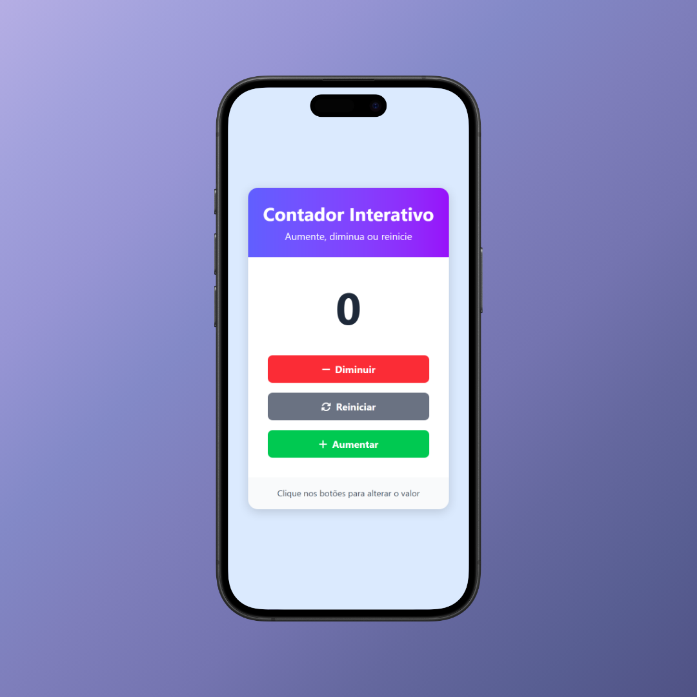
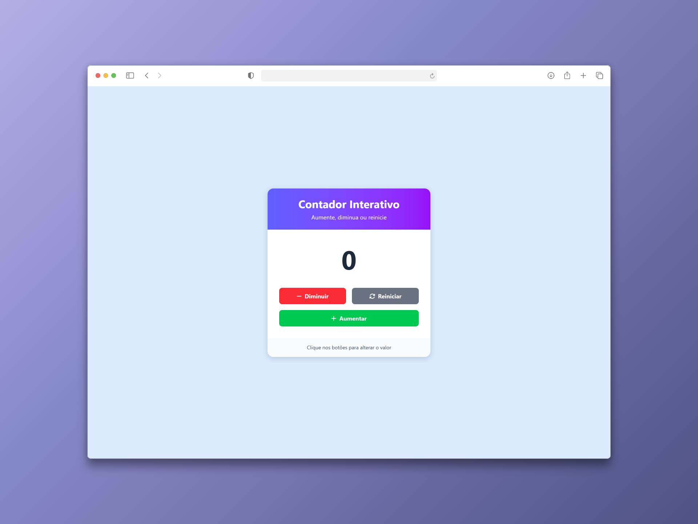

# Angular Counter Demo

Este projeto é uma aplicação de contador desenvolvida para praticar e demonstrar recursos modernos do Angular 19+, como signals para gerenciamento reativo de estado, control flow nativo (`@if`, `@for`), standalone components e outras boas práticas recomendadas pela equipe Angular.

## Sumário

- [Objetivo](#objetivo)
- [Pré-requisitos](#pré-requisitos)
- [Como Executar](#como-executar)
- [Screenshots](#screenshots)
- [Estrutura do Projeto](#estrutura-do-projeto)

## Objetivo

O objetivo deste projeto é servir como um exemplo prático e didático de como construir aplicações Angular modernas, utilizando as funcionalidades mais recentes do framework para garantir código limpo, eficiente e de fácil manutenção. O contador implementa:

- Gerenciamento de estado local com signals
- Uso de control flow nativo no template
- Componentização seguindo o padrão standalone
- Boas práticas de performance e arquitetura

## Pré-requisitos

Escolha uma das opções para executar o projeto:

- [Node.js](https://nodejs.org/en/download) (versão recomendada: 18+)
- [Angular CLI](https://v19.angular.dev/installation) (versão 19+)
- [Docker](https://www.docker.com/)

## Como Executar

Você pode executar o projeto de duas formas:

1. **Com Docker** (recomendado para evitar configurações locais)
2. **Localmente com Node.js/Angular CLI**

### Clone o Projeto

Clone este repositório em sua máquina local:

```bash
git clone https://github.com/kauatwn/angular-counter-demo.git
```

### Executar com Docker

1. Navegue até a pasta raiz do projeto:

   ```bash
   cd angular-counter-demo
   ```

2. Construa a imagem Docker:

   ```bash
   docker build -t angular-counter-demo .
   ```

3. Execute o container:

   ```bash
   docker run --rm -p 8080:80 angular-counter-demo
   ```

Após executar os comandos acima, a aplicação estará disponível em [http://localhost:8080](http://localhost:8080).

### Executar Localmente

1. Acesse a pasta do projeto:

   ```bash
   cd angular-counter-demo
   ```

2. Instale as dependências:

   ```bash
   npm install
   ```

3. Inicie o servidor de desenvolvimento:

   ```bash
   npm start
   ```

4. Acesse a aplicação em [http://localhost:4200](http://localhost:4200).

## Screenshots

Abaixo alguns exemplos da interface da aplicação:




## Estrutura do Projeto

O projeto está organizado da seguinte forma:

```plaintext
angular-counter-demo/
└── src/
    ├── app/
    │   ├── features/
    │   │   └── counter/
    │   │       └── counter.component.*
    │   ├── app.component.*
    │   ├── app.config.ts
    │   └── app.router.ts
    ├── index.html
    ├── main.ts
    └── styles.css
```

Cada componente do contador é independente, focado em uma única responsabilidade e utiliza signals para o gerenciamento de estado.
